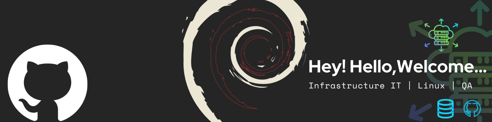
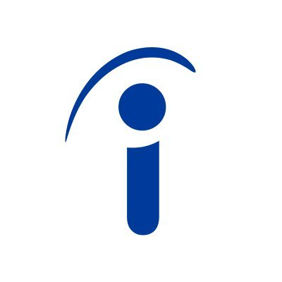

 
 

# Hey,[I'm Brayan Yesca!](https://www.youtube.com/channel/UCietjxpksncMdOUkycv5nqA)

 

I'm an IT Technician with a strong interest in IT Infrastructure, Linux System Administration, Automation, and Software Quality Assurance (QA).

I'm currently strengthening my technical skills through hands-on labs, technical projects, and professional documentation on GitHub to build practical experience and a solid technical portfolio.

## 🚀 Areas of Focus

- 🐧 Linux System Administration
- 🧪 Software Quality Assurance (QA)
- 🐍 Python Automation
- 🗄️ Databases (SQL, PostgreSQL, MySQL, and Oracle)
- 🌐 Infrastructure and Networking
- 🪟 Microsoft Technologies & Active Directory
- 🔐 Cybersecurity
- ⚙️ DevOps (learning path)

## 🎯 Professional Goal

My goal is to grow professionally in IT Infrastructure, Linux System Administration, and Automation while continuously expanding my knowledge in DevOps, Cloud, and Cybersecurity through hands-on practice, continuous learning, and well-documented technical projects.

> **"Consistent practice, documentation, and continuous improvement build professional experience."**

## <b> Skills</b>

-  Operating Systems:

   
   
   
   
   
   
   
   
   
   
   
   

-  Languages:
  
   
   
   
   
   
   
-  Version Control:

   
   

-  Databases:

    
    
   
-   Infrastructure IT and Tools:

    
    
    
    
    
   	
    
    
    

-   Education:

     
     
     
     
     
     
     

 ## Don't be a stranger! come and say Hi, let's connect and collaborate together
  
 

    
    
    
    
  
  
    
  

  

   
   
   
   
